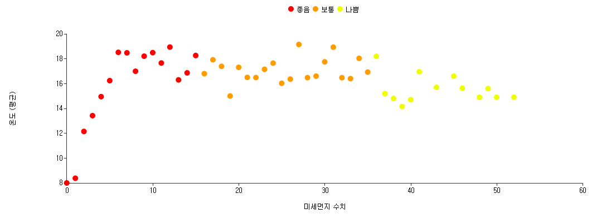
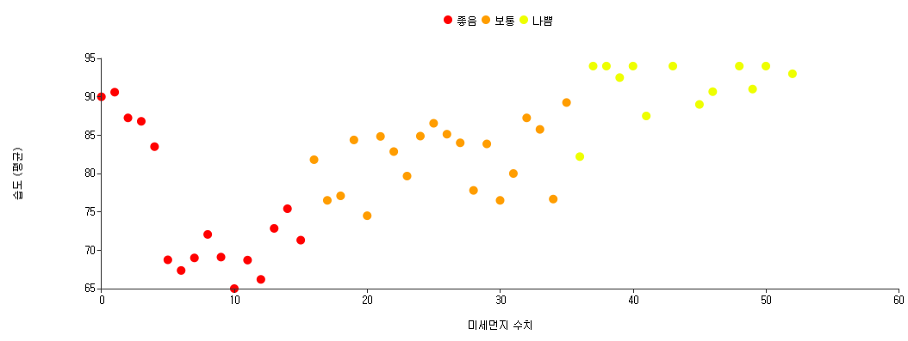
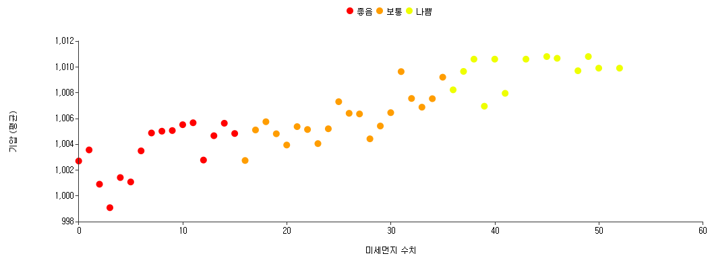
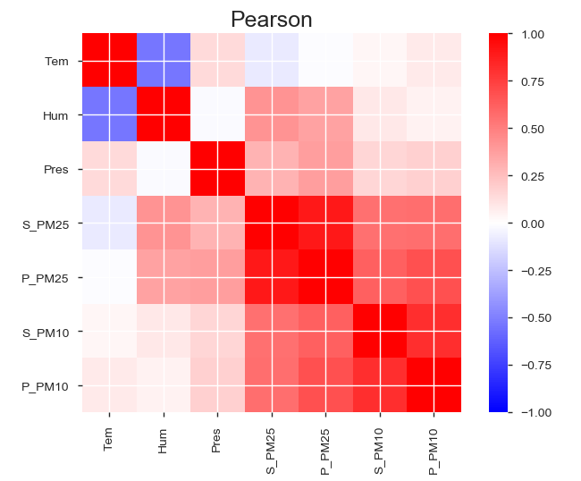

# 기후요인에 따른 미세먼지 상관관계에 대한 고찰

ESP32와 환경 센서를 활용한 대기환경 모니터링 및 미세먼지 예측 시스템 구축

## 프로젝트 개요

본 프로젝트는 기상 요소(온도, 습도, 기압)와 미세먼지 농도 간의 상관관계를 분석하고, 머신러닝 모델을 통해 미세먼지 농도를 예측하는 시스템을 구현해내고자 합니다.

## 자세한 프로젝트 정보

자세한 프로젝트 정보 및 결과는 아래 노션 페이지를 참고 바랍니다.

## 주요 기능

### 데이터 수집 방법

위성 시스템은 다음과 같이 구성되어 있습니다:

-   옥상 설치형 측정 위성

    -   AHT20+BMP280 센서로 온습도/대기압 측정
    -   매시간 정기적 데이터 수집
    -   HC-12 안테나를 통한 무선 데이터 전송

-   실내 수신 시스템
    -   HC-12 안테나로 데이터 수신
    -   PLX-DAQ를 활용한 Excel 데이터 저장
    -   실시간 데이터 모니터링

## 사용 기술

-   **하드웨어**

    -   Espressif ESP32 Dev module
    -   AHT20+BMP280 (온습도/대기압/고도센서)
    -   HC-12 (안테나)

-   **소프트웨어**
    -   Python(pandas, sklearn, matplotlib, seaborn)
    -   Brightics Studio
    -   Arduino IDE
    -   Espressif ESP32
    -   AHT20+BMP280
    -   HC-12
    -   PLX-DAQ

## 데이터 그래프

### 기상 요소별 그래프

### 상관관계 분석

## 시연 영상

### 위성 시스템 구동 영상

https://github.com/tionlab/ClimaDust/raw/main/media/1.mp4

### 실시간 데이터 수신 영상

https://github.com/tionlab/ClimaDust/raw/main/media/2.mp4
